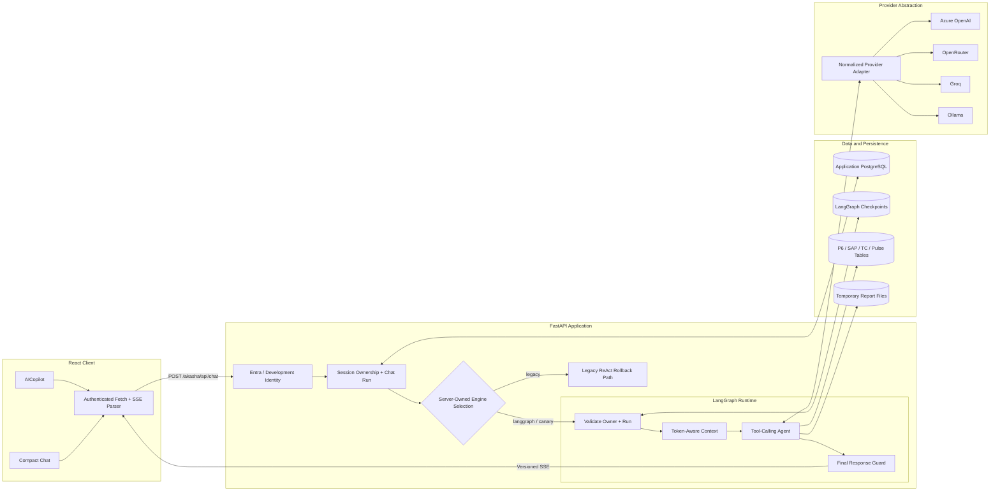
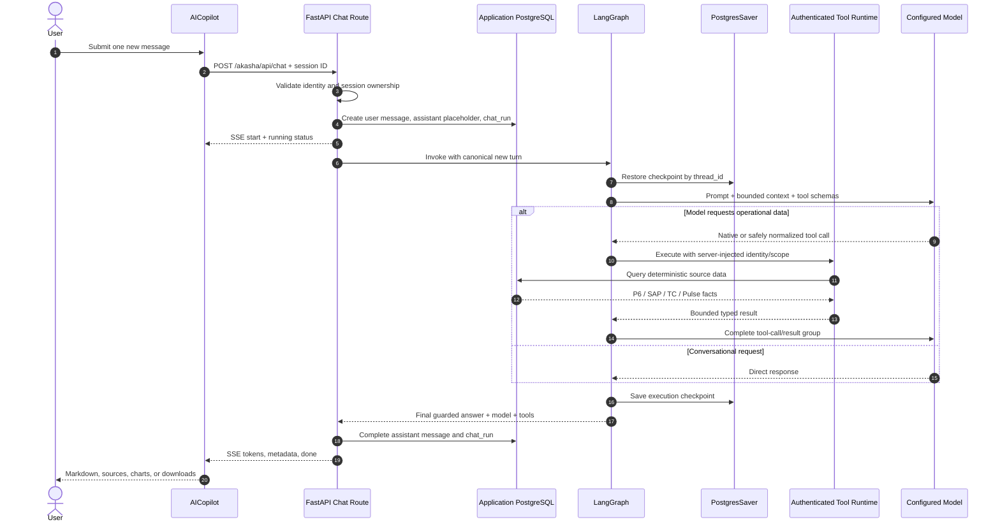
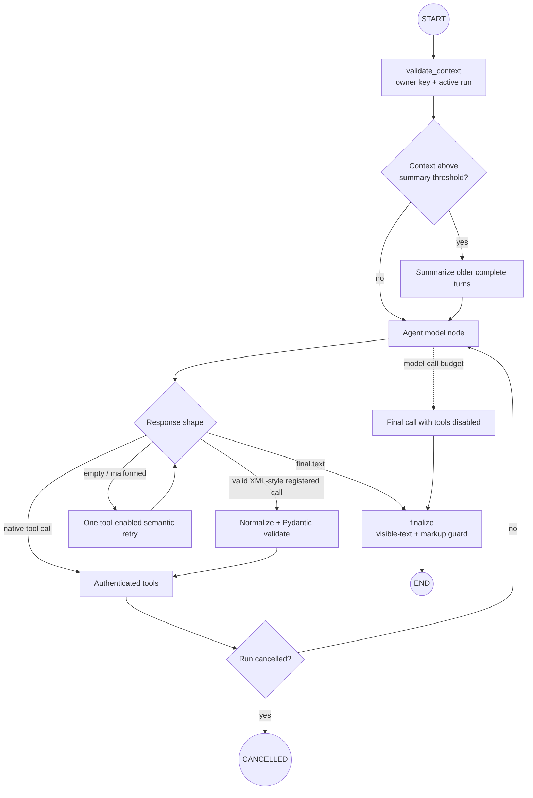
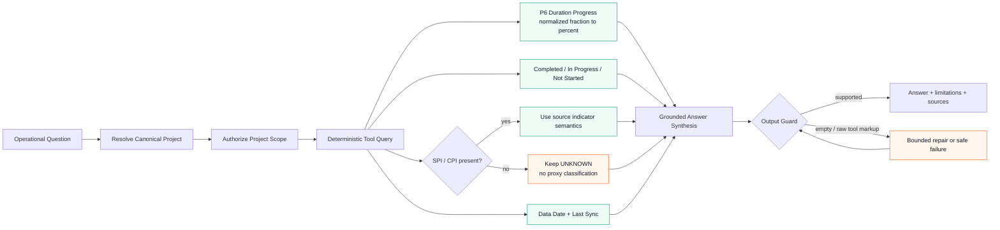
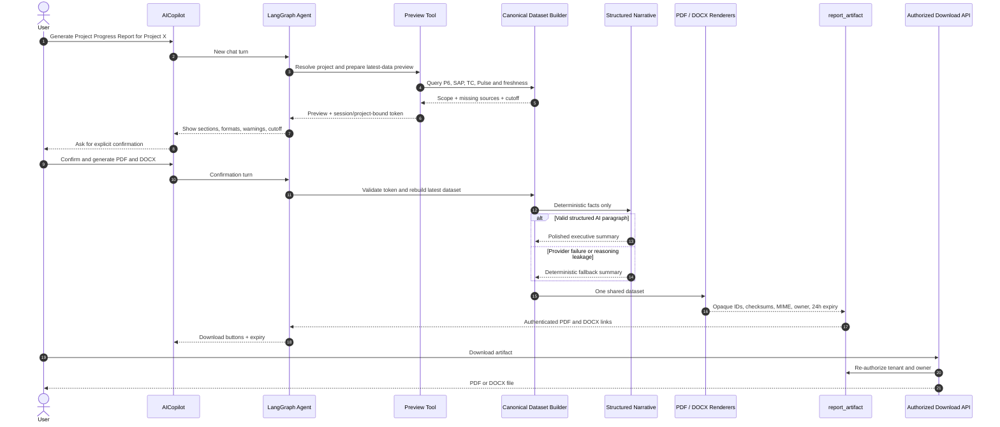

# Akasha Chatbot Architecture

## 1. Document Purpose

This document describes the chatbot architecture implemented on the
`feature/langgraph-refactor` branch. It explains the runtime request path, why the
application moved from a manual ReAct loop to LangGraph, how conversation persistence and
authorization work, how operational facts are retrieved, what was changed to improve
accuracy, and how the synchronous report-generation MVP works.

`CHATBOT_IMPLEMENTATION_PLAN.md` remains the program roadmap and phase ledger. This
document is the code-as-built architecture for the features currently implemented.

## 2. Implemented Scope

The branch contains:

- Phase 0 safety, observability, SSE, report-correctness, and test foundations.
- Phase 1 Microsoft Entra/development identity, private canonical conversations, and typed
  streaming.
- Phase 2 LangGraph execution, PostgreSQL checkpoints, token-aware context management,
  authenticated tools, cancellation, durable run states, and rollout controls.
- Post-Phase-2 accuracy corrections for P6 progress, unavailable SPI/CPI handling,
  activity listing, and malformed provider tool-call recovery.
- A chatbot-first Project Progress Report MVP producing PDF and DOCX files synchronously.

The following roadmap items are not yet implemented:

- A Phase 3 claim/evidence verifier covering every material answer claim.
- A business-validated Phase 4 evaluation dataset and measured accuracy claim.
- Durable report jobs, a report worker, retries, scheduling, XLSX reports, Portfolio
  Executive reports, and Weekly PMAG reports.
- A permanent report repository or cross-chat long-term memory.

## 3. Why Akasha Migrated to LangGraph

### 3.1 Previous Manual ReAct Loop

The original active agent in `backend/engine/agent.py` manually maintained an array of
messages and repeatedly called a provider until the model stopped requesting tools. It
was useful as an initial implementation, but it had important production limitations:

- Only a small client-provided history window was considered.
- The browser was treated as the source of conversation history.
- Execution state did not survive API restarts.
- Tool-call/result protocol groups could be truncated or orphaned.
- Failed and cancelled turns were not represented durably.
- There was no thread ownership check inside persisted agent state.
- Context was limited by message count rather than model-aware token budgets.
- The loop and provider behavior were difficult to test as explicit execution states.
- Report confirmation could not be resumed reliably after a page refresh.

The manual path is retained only as the `legacy` rollback engine.

### 3.2 Benefits of LangGraph

LangGraph provides a checkpointed state machine rather than an unrestricted loop. Akasha
uses it to obtain:

- A durable `thread_id` for every private chat session.
- Explicit graph nodes for validation, context compaction, agent execution, tools, and
  finalization.
- PostgreSQL checkpoint recovery after API process recreation.
- Complete assistant-tool-call and tool-result grouping.
- Serializable execution state with no ORM sessions, credentials, or binary files.
- Deterministic cancellation and run-status boundaries.
- Testable recursion and model-call limits.
- A controlled migration path with `legacy`, `canary`, and `langgraph` modes.

LangGraph does not replace the application transcript. It owns execution continuity;
Akasha application tables remain the source of the user-visible conversation and access
control.

## 4. High-Level Runtime Architecture



The diagram separates four important boundaries: the browser is not authoritative for
history or identity, FastAPI owns authorization and run lifecycle, LangGraph owns resumable
execution, and PostgreSQL/source tables own durable facts.

```text
React AICopilot / compact chat
        |
        | Entra bearer token or local development identity
        | POST /akasha/api/chat
        v
FastAPI authentication and session ownership
        |
        +--> canonical chat_message + chat_run records
        |
        v
server-owned engine selection
        |
        +--> legacy manual ReAct loop (rollback)
        |
        +--> LangGraph parent graph
                |
                +--> validate checkpoint owner and run state
                +--> compact context when required
                +--> tool-calling agent subgraph
                |       +--> provider model
                |       +--> authenticated deterministic tools
                |       +--> P6 / SAP / TC / Pulse-backed tables
                +--> validate/finalize visible response
                |
                v
          PostgreSQL PostgresSaver checkpoints
        |
        v
typed SSE events -> frontend parser -> Markdown/charts/download buttons
```

## 5. Frontend Architecture

### 5.1 Canonical Chat Surface

`frontend/src/features/chatbot/AICopilot.tsx` is the full chatbot experience. It provides:

- Session listing, creation, reopening, rename, and deletion.
- Message submission without client-authoritative history.
- Typed SSE processing and progress display.
- Cancellation controls and restored failed/cancelled states.
- Markdown, tables, charts, source labels, feedback, and report downloads.
- A one-time consent flow for importing or discarding legacy browser chats.

`ScenarioSimulationPanel.tsx` is a compact surface over the same backend sessions and
transport. It intentionally does not implement the full visualization/report experience.

### 5.2 Authenticated Transport

`frontend/src/auth/authenticatedFetch.ts` wraps same-origin Akasha API requests:

- In Entra mode it attaches an MSAL access token.
- In development mode it attaches the selected temporary user and CEO/PMAG role headers.
- Credentials are never attached to third-party origins.
- HTTP 401 invokes the configured logout/identity reset behavior.

### 5.3 Typed SSE

`frontend/src/features/chatbot/chatStream.ts` parses versioned events and verifies Phase 2
correlation and sequence ordering. The active stream includes:

- `start`
- `status`
- `token`
- `visualization`
- `metadata`
- `error`
- `cancelled`
- `done`

Every Phase 2 event carries request, session, run, stream-version, and sequence metadata.
A clean network EOF without `done` is treated as interrupted, not successful.

The current backend generates the final model answer before splitting it into textual SSE
chunks. The protocol is streaming-safe, but this is not provider-token streaming.

### 5.4 End-to-End Chat Request Sequence



## 6. API, Identity, and Authorization

`backend/main.py` registers all business routers behind CEO/PMAG authentication.

### 6.1 Development Mode

Development mode is intended only for a trusted local machine. The browser creates a
temporary identifier in session storage and lets the developer select `executive` or
`pmag`. The backend accepts only bounded development IDs and those two roles.

### 6.2 Microsoft Entra Mode

In Entra mode, `backend/security.py` validates:

- RS256 signature through the tenant JWKS endpoint.
- Issuer, audience, tenant, and expiration.
- User object ID.
- Supported `Akasha.CEO` or `Akasha.PMAG` app role/group assignment.

Detailed Entra registration instructions remain in `AUTHENTICATION_SETUP.md`.

### 6.3 Ownership Boundaries

Session, message, feedback, run, checkpoint, and report-artifact access is scoped by tenant
and user. Unknown or cross-user session/artifact identifiers return non-disclosing errors.
The model cannot supply user identity, tenant, role, session ownership, or run ownership.

## 7. Conversation and Execution Persistence

```mermaid
flowchart TB
    Identity["Authenticated Tenant + User"] --> Session["chat_session\ncanonical private thread"]
    Session --> Message["chat_message\nvisible transcript + status"]
    Session --> Run["chat_run\none lifecycle per turn"]
    Message --> Feedback["chat_feedback\nowner-checked rating"]
    Session --> Artifact["report_artifact\n24-hour file metadata"]
    Session -. "same random session_id" .-> Thread["LangGraph thread_id"]
    Thread --> Checkpoint["checkpoints"]
    Checkpoint --> Blob["checkpoint_blobs"]
    Checkpoint --> Writes["checkpoint_writes"]

    Source[("P6 / SAP / TC / Pulse")] -->|"live facts only"| Message
    Summary["Derived Conversation Summary"] -->|"continuity, never evidence"| Checkpoint

    classDef app fill:#e8f1ff,stroke:#2563eb,color:#0f172a;
    classDef graph fill:#f3e8ff,stroke:#7c3aed,color:#0f172a;
    classDef source fill:#ecfdf5,stroke:#059669,color:#0f172a;
    class Session,Message,Run,Feedback,Artifact app;
    class Thread,Checkpoint,Blob,Writes,Summary graph;
    class Source source;
```

The solid application-table relationships represent user-visible ownership and lifecycle.
The dotted `session_id`/`thread_id` relationship joins that application thread to LangGraph
execution without making checkpoints the canonical transcript.

### 7.1 Application Tables

- `chat_session`: canonical private conversation and stable engine assignment.
- `chat_message`: user-visible transcript, state, model, source/tool metadata, and charts.
- `chat_run`: one durable lifecycle record per submitted turn.
- `chat_feedback`: ownership-checked user feedback.
- `report_artifact`: temporary generated-file metadata and ownership.

The user message, assistant placeholder, and run are committed before model execution.
Assistant/run status then moves through running, completed, failed, cancelled, or
interrupted states.

### 7.2 LangGraph Checkpoints

The application `chat_session.session_id` is also the LangGraph `thread_id`. A process-owned
Psycopg 3 pool and `PostgresSaver` are initialized in FastAPI lifespan. Checkpoint DDL is
created by `backend/scripts/setup_langgraph_checkpoint.py`, never implicitly by an API
request.

Each checkpoint stores a tenant/user owner key. Ownership is checked again inside the graph
even after the API route has authorized the session.

Deleting a LangGraph session tombstones it, deletes the checkpoint thread, and then removes
application rows. Failed or cancelled graph turns reset the checkpoint before the next turn
so an incomplete tool protocol cannot poison resumed history.

## 8. LangGraph Execution

The parent graph in `backend/engine/graph/builder.py` is:



```text
START
  -> validate_context
  -> compact_context
  -> agent subgraph
       -> model
       -> tools (when native/normalized tool calls exist)
       -> model ...
  -> finalize
  -> END
```

### 8.1 State

`AkashaState` contains only serializable execution data: messages, derived summary, owner
and thread identity, selected project scope, transcript cursor, run/request IDs, model name,
tool names, visualizations, and bounded execution counters.

Database sessions, ORM objects, credentials, report binaries, and provider clients are not
checkpointed.

### 8.2 Context Management

The model context window is discovered from the configured provider/model. Akasha reserves
capacity for output, the system prompt, and tool schemas. Summarization starts near 60% of
usable context and a hard bound applies near 80%.

Context compaction:

- Keeps at least the four newest complete turns.
- Never separates an assistant tool call from its tool results.
- Summarizes older conversation only for continuity.
- Treats summaries as derived context, never live operational evidence.
- Bounds oversized recent messages/tool results without dropping protocol messages.
- Leaves the complete canonical transcript in application tables.

### 8.3 Loop Safety and Invalid Provider Output

The graph has a configurable model-call budget and a LangGraph recursion backstop. The last
permitted model call has tools disabled and must synthesize from evidence already collected.

Some OpenAI-compatible models intermittently emit XML-like textual tool calls instead of
native calls. Akasha safely normalizes one complete raw call only when:

- The tool name is registered.
- No extra prose or duplicate parameters exists.
- All arguments pass the same strict Pydantic contract as native calls.

Malformed markup, invalid native calls, and empty responses receive one tool-enabled
semantic retry. Raw tool syntax is never rendered to the user. Diagnostics record only the
failure category, request ID, iteration, and validated tool name, not response content or
arguments.

## 9. Provider Abstraction

`backend/engine/model_provider.py` centralizes invocation, structured JSON, tool calling,
streaming, timeouts, retries, token usage, model identity, and sanitized provider failures.
Adapters exist for:

- Azure OpenAI
- OpenRouter
- Groq
- Ollama

Capabilities required by the selected mode are validated. OpenRouter can supply an ordered
native fallback list; context budgeting uses the smallest configured model window. Free or
third-party endpoints must not receive confidential project information without approved
privacy terms.

## 10. Authenticated Tool Runtime

Tool schemas originate in `backend/engine/agent.py`; the LangGraph runtime replaces their
argument definitions with strict Pydantic schemas from `backend/engine/graph/tools.py`.

For every tool call, Akasha:

- Rejects unknown fields and invalid types.
- Bounds limits, offsets, thresholds, ranges, and multipliers.
- Injects authenticated identity, role, session, request, and run context server-side.
- Verifies project existence and selected project scope independently of the model.
- Prevents scoped sessions from invoking portfolio-wide tools.
- Opens and closes an isolated SQLAlchemy session.
- Checks durable cancellation before and after work.
- Bounds tool output before it enters model context/checkpoints.
- Returns safe error text instead of internal exceptions.

Tools cover project resolution, P6 summaries and activities, SAP procurement/materials,
transmission, notifications, deterministic KPI calculations, simulations, charts, and the
Project Progress Report MVP.

## 11. Facts and Accuracy Improvements



The accuracy strategy is deliberately semantic rather than cosmetic: code computes or reads
facts under documented meanings, while the model selects tools and explains returned facts.
Missing indicators are never replaced with plausible-looking substitutes.

### 11.1 Evidence-First Prompt and Tool Use

Operational claims must come from tools. The system prompt requires project-name resolution,
human-readable project names, source units, disclosed limitations, and source timestamps when
available. Conversation summaries cannot serve as current evidence; live questions re-query
tools.

### 11.2 P6 Progress Semantics

The database stores `SummaryDurationPercentComplete` as a fraction for current P6 data. It is
normalized to a displayed percentage and is the authoritative overall P6 duration progress.

Completed activities divided by total activities is retained as a separate
`activity_completion_pct`; it is not substituted for overall progress.

### 11.3 SPI, CPI, and Classification

Null SPI/CPI values remain unavailable. Akasha no longer manufactures an SPI proxy from
activity counts or baseline-finish counts. When SPI is unavailable:

- Schedule status remains `UNKNOWN`.
- Schedule percentage variance is not invented.
- Composite project health remains `UNKNOWN`.
- The answer explicitly states why ahead/behind classification is unavailable.

Descriptive facts such as completed/in-progress/not-started counts, critical activities,
baseline deadline exposure, dates, and freshness can still be reported under their actual
meaning.

### 11.4 Activity Detail

`p6_get_activities` lists bounded, deterministically ordered activities filtered by all,
completed, in-progress, or not-started status. This prevents the model from inventing an
unsupported activity-listing tool on follow-up questions.

### 11.5 Output Quality Boundaries

- Empty final answers are repaired once and cannot be persisted as successful blank turns.
- Raw tool markup is normalized safely or rejected.
- Report executive narratives use structured JSON, reject planning/reasoning leakage, and
  fall back to deterministic prose.
- Missing data remains missing rather than becoming zero or a healthy status.
- Provider errors are reduced to stable public codes while details stay server-side.

### 11.6 Evaluation Status

The repository includes a deterministic provisional evaluator seeded from workbook questions.
Its fixtures are synthetic and explicitly not a production accuracy measurement. A business-
validated benchmark and claim-level evidence verifier remain future work; no production
accuracy percentage should be claimed yet.

## 12. Project Progress Report MVP

### 12.1 Chat Flow



```text
User asks for a Project Progress Report
  -> resolve canonical project
  -> report_preview_project_progress
  -> display scope, latest cutoff, sections, freshness, missing sources, PDF/DOCX
  -> wait for explicit confirmation
  -> report_generate_project_progress with session/project-bound preview token
  -> build one deterministic dataset
  -> generate constrained executive narrative (or deterministic fallback)
  -> render PDF and DOCX from the same dataset
  -> persist owner-scoped artifacts
  -> return authenticated download buttons in chat
```

### 12.2 Canonical Dataset

`backend/services/report_mvp_service.py` builds one in-memory dataset containing:

- Project identity, status, reporting cutoff, and source freshness.
- Corrected P6 progress and activity counts.
- A bounded in-progress activity list.
- SAP procurement summary.
- TC transmission summary.
- Pulse NC/RFI summary.
- Missing-source disclosure.

All numbers come from deterministic services. The optional model writes only the executive
paragraph from supplied facts. If structured output is invalid, contains planning text, or the
provider fails, deterministic prose is used.

### 12.3 Rendering and Downloads

- PDF: ReportLab.
- DOCX: `python-docx`.
- Both use the same dataset and simple Akasha branding.
- Files are stored below `AKASHA_REPORT_ARTIFACT_DIR` or `backend/report_artifacts`.
- Database records contain opaque ID, owner, tenant, path, MIME type, checksum, size, and
  expiry.
- Downloads re-authorize tenant/user ownership.
- Artifacts expire after 24 hours.
- Cleanup is opportunistic during generation/download.

### 12.4 MVP Limitations

Generation is synchronous and can increase chat request latency. Files are local to one host.
Preview signing keys are process-local, so an unconfirmed preview must be recreated after an
API restart. There is no durable report queue, worker, retry workflow, XLSX renderer, report
page, scheduling, or horizontal-storage design yet.

## 13. Rollout and Recovery

`AKASHA_CHAT_ENGINE` controls new turns:

- `legacy`: immediate rollback to the manual ReAct engine.
- `langgraph`: all sessions use LangGraph.
- `canary`: deterministic tenant/user/session cohort assignment using
  `AKASHA_LANGGRAPH_ROLLOUT_PERCENT`.

The assignment is stored on the session. The browser cannot select an engine. Canonical
transcript reconciliation lets completed legacy turns enter a graph thread after re-enabling
LangGraph.

## 14. Observability

Correlation spans HTTP request ID, session, run, message, checkpoint, tools, and model. Logs
include lifecycle events, latency, tool status/duration, model identity, and safe exception
structure. Session IDs are pseudonymized in logs, incoming request IDs are not trusted, and
conversation/tool payloads are not logged by the observability contract.

## 15. Important Code Map

| Concern | Main files |
|---|---|
| Full chat UI | `frontend/src/features/chatbot/AICopilot.tsx` |
| Chat API and SSE | `frontend/src/features/chatbot/chatApi.ts`, `chatStream.ts`, `chatContract.ts` |
| Authenticated frontend fetch | `frontend/src/auth/authenticatedFetch.ts`, `msal.ts` |
| Chat/session API | `backend/routers/ai.py`, `chat_sessions.py`, `chat_feedback.py` |
| Identity/authorization | `backend/security.py`, `backend/auth_claims.py` |
| Graph construction | `backend/engine/graph/builder.py` |
| Graph lifecycle/checkpoints | `backend/engine/graph/service.py` |
| Context policy | `backend/engine/graph/context_policy.py` |
| Authenticated tools | `backend/engine/graph/tools.py`, `backend/engine/agent.py` |
| Provider adapters | `backend/engine/model_provider.py`, `openrouter_config.py` |
| P6 accuracy logic | `backend/engine/kpi_engine.py`, `backend/engine/tools/p6_tools.py` |
| Run lifecycle | `backend/services/chat_run_service.py` |
| Report dataset/narrative | `backend/services/report_mvp_service.py` |
| Report rendering/download | `backend/services/report_renderers.py`, `backend/routers/reports_mvp.py` |
| Application models | `backend/models.py` |
| Setup/migrations | `LOCAL_SETUP.md`, `backend/migrations/`, `setup_langgraph_checkpoint.py` |
| Tests | `backend/tests/`, `frontend/tests/` |

## 16. Further Reading

- Full implementation roadmap and phase ledger: `CHATBOT_IMPLEMENTATION_PLAN.md`
- Complete local runbook: `LOCAL_SETUP.md`
- Entra registration: `AUTHENTICATION_SETUP.md`
- Historical pre-LangGraph baseline: `backend/ACTIVE_CHATBOT_PATH.md`
