# Akasha Chatbot: New Architecture, Shared Services, and Visualizations

## 1. Purpose

This document explains the current Akasha chatbot architecture after two related changes:

1. The chatbot runtime moved from a manual ReAct loop to a durable LangGraph workflow.
2. Dashboard and chatbot calculations moved into shared authoritative backend services.

Together, these changes solve two different problems:

- **Execution consistency:** a chat turn can be authorized, checkpointed, cancelled, resumed, and audited safely.
- **Data consistency:** the dashboard, chatbot, charts, and reports obtain the same business facts from the same calculations.

The central idea is simple:

> The model decides what information is needed and explains the result. Shared backend services decide what the business facts are.

---

## Part I - Architecture and Shared Backend Services

## 2. The Architecture in One Picture

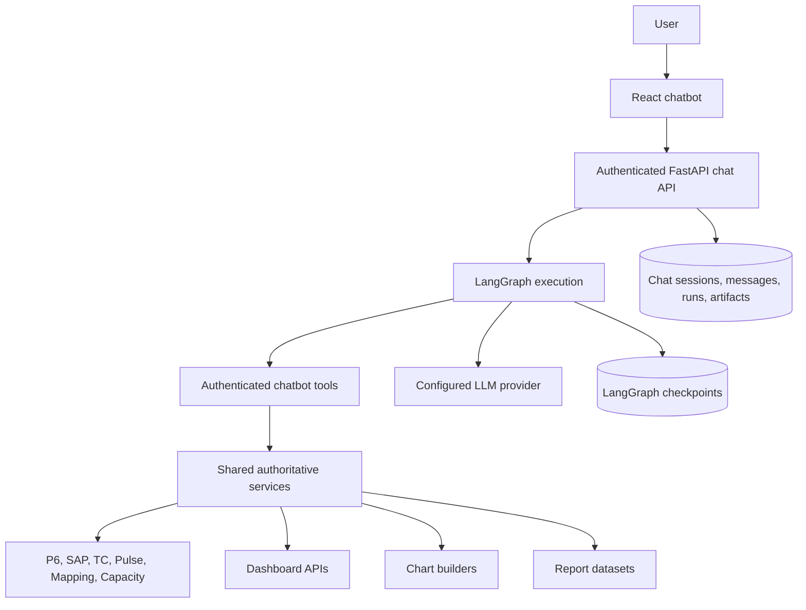

The shared service layer is the architectural center. It prevents the dashboard, chatbot, charts, and reports from creating different answers for the same project and source snapshot.

## 3. What Was There Before?

### 3.1 Previous chatbot runtime

The original chatbot used a manually coded ReAct loop. The backend maintained a message array, called the model, executed requested tools, appended tool results, and repeated until the model returned text.

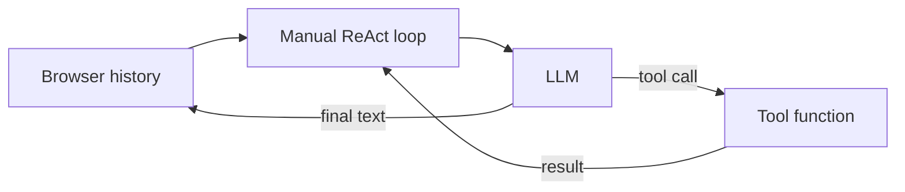

This worked as an initial agent, but the browser carried too much responsibility and the execution loop had no durable state machine.

Main limitations included:

- Conversation context depended heavily on a small history window sent by the client.
- Execution state did not survive an API restart.
- Tool-call and tool-result groups could be truncated or orphaned.
- Failed and cancelled turns were not represented as durable lifecycle states.
- Context was bounded mainly by message count rather than model-aware token budgets.
- Ownership was not independently checked inside persisted agent execution state.
- The loop was difficult to inspect and test as explicit states.
- A report confirmation flow could not be reliably resumed after a refresh.

### 3.2 Previous business-data architecture

The dashboard and chatbot queried the same database, but they often used different code paths and calculations.

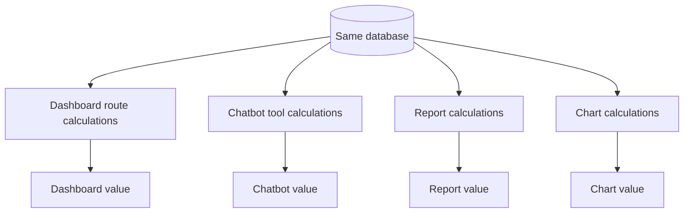

Because filtering, mapping, joins, fallbacks, rounding, and formulas were repeated, equivalent questions could produce different results.

Examples of earlier divergence included:

- Project population and portfolio filtering implemented in several places.
- Different progress calculations in Overview, Project 360, PMAG, and chatbot tools.
- Different SAP matching rules, including exact WBS, substring WBS, hierarchy matching, and plant fallback.
- Different transmission association and deduplication rules.
- Separate capacity and quality matching logic.
- Several unrelated calculations described simply as a "risk score."
- Dashboard process caches returning a different data version from live chatbot queries.
- Charts and reports independently rebuilding facts.

## 4. What Is There Now?

The current design has two coordinated layers: a durable chatbot runtime and an authoritative business-fact layer.

```mermaid
flowchart LR
    subgraph Experience["User experience"]
        Chat["Chat"]
        Dash["Dashboard"]
        Report["PDF and DOCX"]
        Visual["Charts"]
    end

    subgraph Adapters["Thin adapters"]
        ChatTools["Chat tools"]
        Routes["Dashboard routes"]
        ReportBuilder["Report builder"]
        ChartBuilder["Chart builder"]
    end

    subgraph Domain["Authoritative domain layer"]
        Catalog["Project catalog"]
        Schedule["Schedule"]
        SAP["SAP"]
        TC["Transmission"]
        Capacity["Capacity"]
        Quality["Quality"]
        Risk["Named risk metrics"]
        Freshness["Freshness and provenance"]
    end

    Experience --> Adapters --> Domain --> DB[("Operational database")]
```

Thin adapters do not own business formulas. Their job is to validate a request, call the relevant service, preserve the required API/tool contract, and serialize the result.

## 5. New End-to-End Chat Request Flow

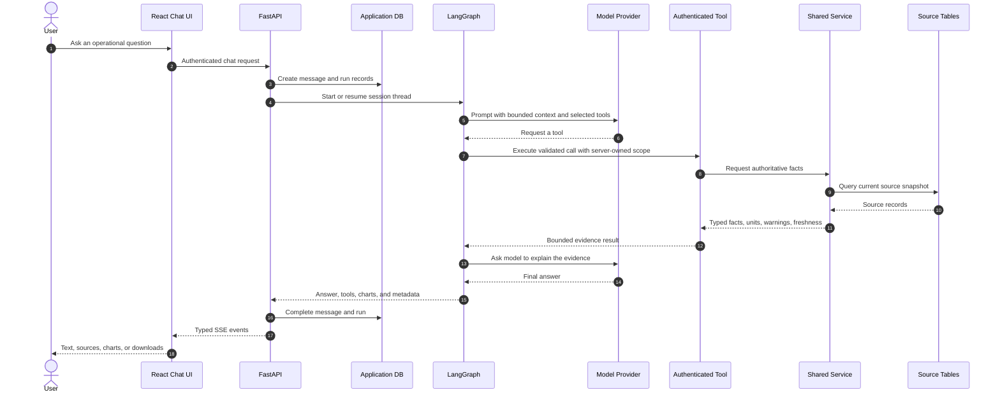

The LLM is deliberately outside the calculation path. It never supplies the project scope, identity, formula inputs, or chart numbers.

## 6. LangGraph Runtime

The LangGraph workflow converts the agent from an open-ended loop into an explicit state machine.

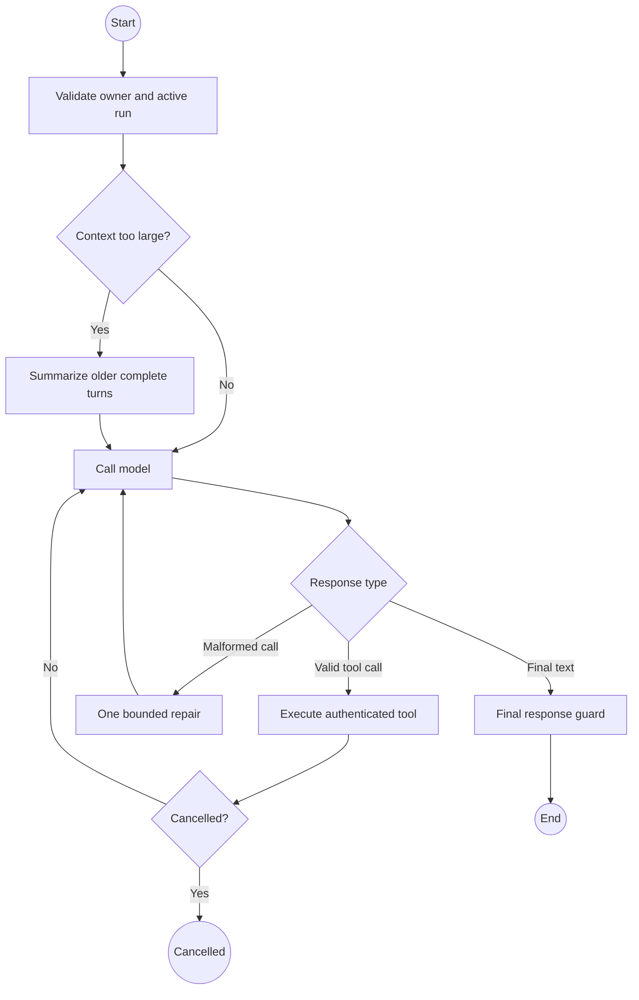

Important runtime properties:

- The application session ID is also the LangGraph thread ID.
- PostgreSQL checkpoints preserve execution continuity.
- Application tables remain the canonical visible transcript and ownership authority.
- Checkpoint state contains only serializable data, never credentials, ORM sessions, provider clients, or report binaries.
- Context compaction keeps recent complete turns and never separates a tool call from its result.
- Summaries help conversation continuity but are never treated as current operational evidence.
- Model-call and recursion limits prevent endless loops.
- Failed or cancelled incomplete tool protocols are reset before the next turn.

## 7. Persistence and Ownership Boundaries

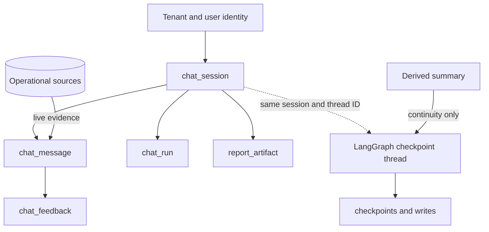

Access to sessions, messages, feedback, runs, checkpoints, and report artifacts is scoped by tenant and user. The model cannot choose or override identity, role, ownership, or selected-project scope.

## 8. Shared Authoritative Services

### 8.1 Service map

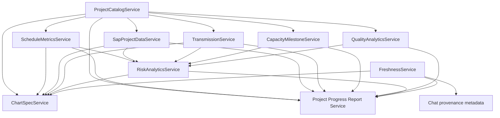

### 8.2 Responsibilities

| Service | Authoritative responsibility |
|---|---|
| `ProjectCatalogService` | Non-demo project population, portfolio scope, identifiers, aliases, mapping metadata, deterministic resolution, and ambiguity handling. |
| `ScheduleMetricsService` | P6 progress, dates, delay, activity counts, variance, SPI/CPI, critical/delayed activities, period progress, and P6 freshness. |
| `SapProjectDataService` | Approved WBS/plant matching, PO totals, delivered and pending quantities, inventory, consumption, vendors, units, and SAP freshness. |
| `TransmissionService` | Latest-record selection, mapping and phase/KPS association, physical-line deduplication, normalized status/progress/dates, readiness, and freshness. |
| `CapacityMilestoneService` | Solar block and wind WTG identity, allocation, COD, Trial Run, remaining capacity, trends, and freshness. |
| `QualityAnalyticsService` | Pulse project matching, NC/RFI counts, closure, aging, trends, contractor scorecards, warnings, and provenance. |
| `RiskAnalyticsService` | Separately named dashboard risk metrics composed from authoritative domain inputs. |
| `FreshnessService` | Data cutoff, sync timestamp, source evidence, durable source versions, cache invalidation tokens, and answer provenance. |
| `ChartSpecService` | Chart-ready datasets derived from authoritative services without a second business calculation. |
| `Project Progress Report Service` | Project, portfolio, and comparison datasets composed from the same authoritative services. |

## 9. How a Metric Is Produced

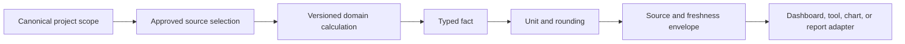

A metric is not just a number. Its contract includes meaning and evidence.

```json
{
  "metric_id": "project.progress",
  "scope": { "project_id": "FY26-P18" },
  "value": 23.1,
  "unit": "percent",
  "formula_version": "dashboard-progress-v1",
  "source_system": "P6",
  "source_tables": ["p6_project"],
  "data_as_of": "2026-07-18T00:00:00Z",
  "last_synced_at": "2026-07-22T05:07:00Z",
  "warnings": []
}
```

The key rules are:

- Counts, identifiers, statuses, and dates use exact values.
- Percentages declare their scale; displayed percentages use `0-100`.
- Durations and variances declare units.
- Currency declares currency and scale.
- Rounding happens once, not independently in every consumer.
- Missing facts remain null or unavailable.
- Formula versions change only when the business meaning changes.
- `data_as_of` is the business-data cutoff.
- `last_synced_at` is the ingestion timestamp.
- `answer_generated_at` records when the response was produced.

## 10. Important Shared Calculations

### 10.1 P6 schedule progress

The schedule service uses the approved precedence below:

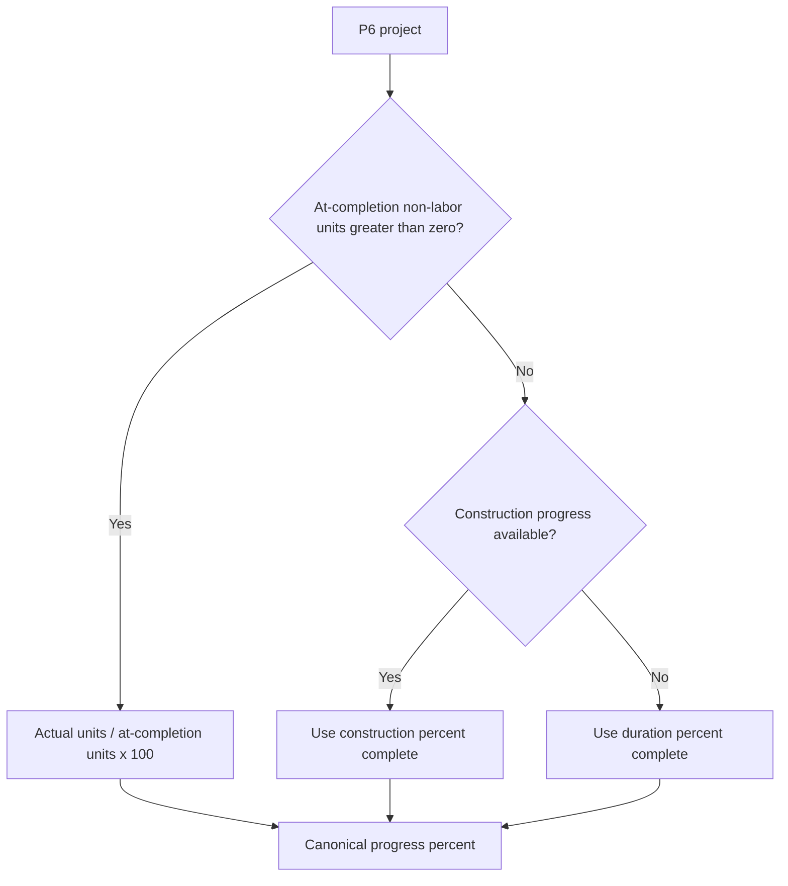

Activity completion percentage remains a different metric. It is not substituted for overall schedule progress.

### 10.2 Delay calculation

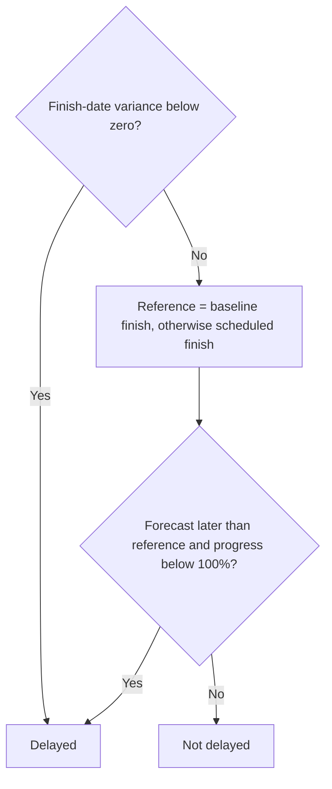

Baseline finish takes precedence over scheduled finish. Variance is explicitly represented in days, while duration and float fields retain their declared units.

### 10.3 SAP project matching and aggregation

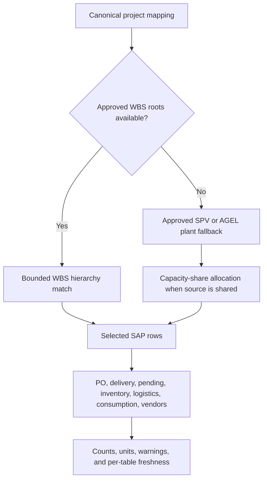

Unsafe substring matching is not used. Purchase-order row count and distinct purchase-order count remain separate. Material issue movements and reversal movements are handled consistently, including reversal types `222` and `262`.

### 10.4 Transmission snapshot

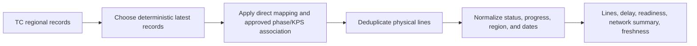

One physical line may be associated with several projects before project-level physical deduplication. This preserves valid cross-project associations without inflating counts within a project.

### 10.5 Capacity milestones

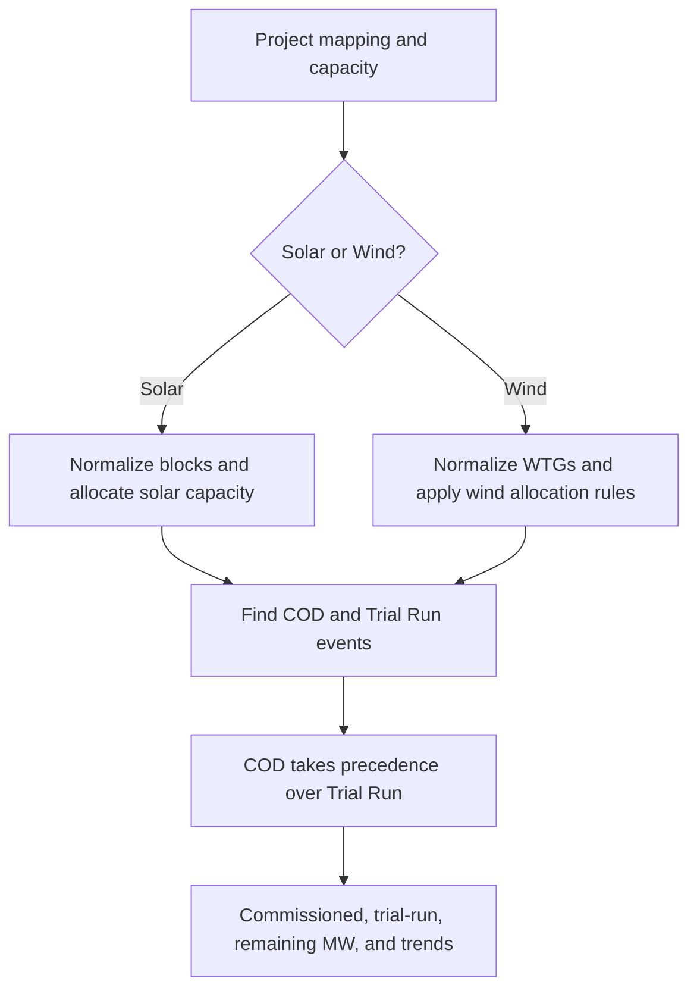

### 10.6 Quality analytics

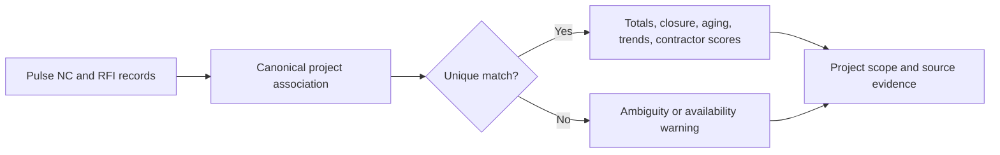

### 10.7 Named risk metrics

The new design does not collapse all risk concepts into one score.

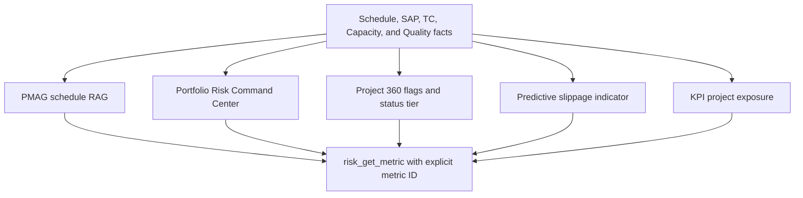

Each risk result carries its own metric ID, formula version, scope, value, unit, classification, components, evidence, availability, heuristic flag, and warnings. The LLM is not allowed to combine these into an unsupported composite.

## 11. Canonical Project Scope and Partial-Source Data

All domains begin with the same non-demo mapping population and the same project resolver.

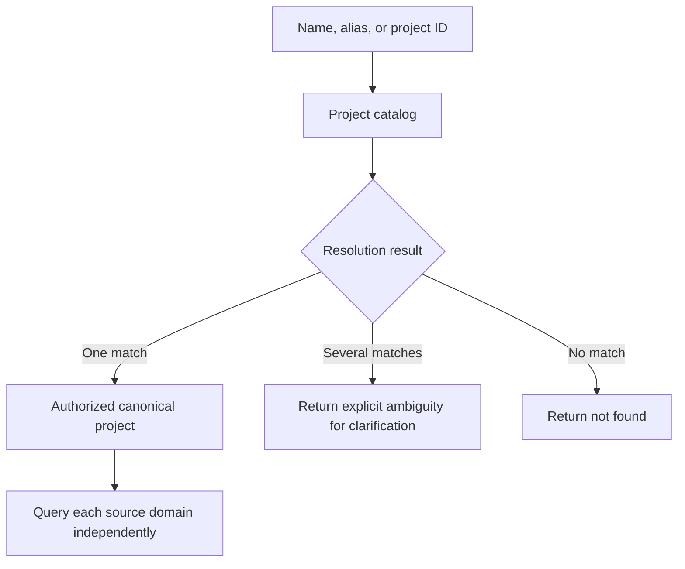

### Missing P6 policy

Missing P6 does not make the entire project disappear.

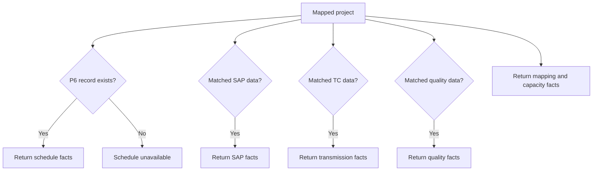

The existing dashboard compatibility adapter may display `On Track` and progress `0` for a mapped project without P6. That fallback is isolated from authoritative schedule facts and must not be emitted as chatbot evidence.

## 12. Tools: Model Choice, Server Control

The chatbot groups tools by domain and exposes a high-recall subset for a clear question.

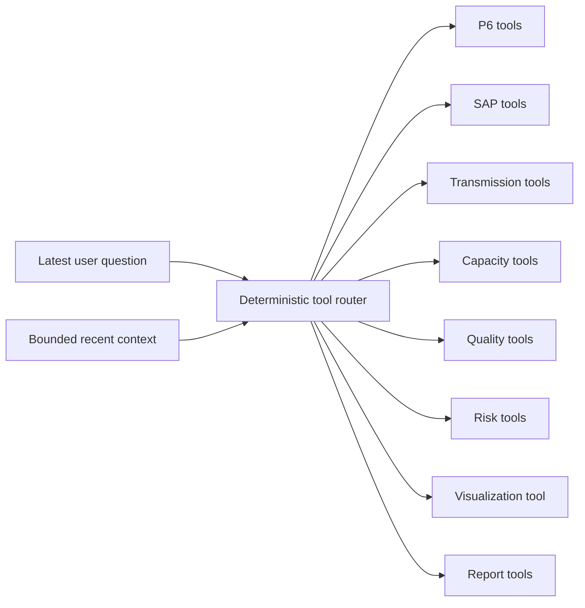

Examples include:

- P6: project summary, activities, critical/delayed activities, status breakdown, block progress, daily completion trend, portfolio milestone risks.
- SAP: PO summary, material gaps, vendor performance, inventory, and consumption.
- Transmission: project lines, at-risk lines, network summary, and line search.
- Capacity: portfolio overview and project status.
- Quality: portfolio overview, project status, and contractor scorecard.
- Risk: one strict `risk_get_metric` tool with an explicit named metric.
- Visualizations: `render_chart` using authoritative chart inputs.
- Reports: preview and generate tools for project, portfolio, and project-comparison reports.

Every executed tool still passes through the same control path:

```mermaid
flowchart LR
    Call["Model tool call"] --> Schema["Strict schema validation"]
    Schema --> Identity["Inject server-owned identity and role"]
    Identity --> Scope["Check project and portfolio scope"]
    Scope --> Cancel["Check durable cancellation"]
    Cancel --> Session["Open isolated database session"]
    Session --> Service["Call shared service"]
    Service --> Bound["Bound result size"]
    Bound --> Result["Safe evidence result"]
```

## 13. Freshness, Provenance, and Cache Alignment

Previously, a dashboard cache could hold a five-minute-old value while the chatbot performed a live query. The new source-version mechanism aligns consumers after synchronization.

```mermaid
sequenceDiagram
    participant Sync as Source Sync
    participant DB as SourceSyncState
    participant Cache as Dashboard and metric caches
    participant Chat as Chatbot provenance

    Sync->>Sync: Complete source ingestion successfully
    Sync->>DB: Advance that source version
    DB-->>Cache: Old version token becomes invalid
    Cache->>Cache: Rebuild on next request
    DB-->>Chat: Supply cutoff, sync time, tables, and version evidence
```

Failed synchronization does not advance the source version. Completed chat responses persist the tools used, source systems, source tables, `data_as_of`, `last_synced_at`, and `answer_generated_at`.

## 14. Reports Use the Same Facts

```mermaid
flowchart TB
    Ask["User asks for a report"] --> Preview["Build latest-data preview"]
    Preview --> Confirm{"Explicit confirmation?"}
    Confirm -->|"No"| Wait["Wait"]
    Confirm -->|"Yes"| Dataset["Rebuild one canonical dataset"]

    Services["Catalog, Schedule, SAP, TC, Capacity, Quality, Risk"] --> Dataset
    Dataset --> Narrative["Constrained narrative or deterministic fallback"]
    Dataset --> PDF["PDF renderer"]
    Dataset --> DOCX["DOCX renderer"]
    Dataset --> StaticCharts["Static chart adapter"]

    PDF --> Artifact["Owner-scoped 24-hour artifact"]
    DOCX --> Artifact
    StaticCharts --> PDF
    StaticCharts --> DOCX
```

The report model may polish an executive paragraph, but it does not calculate the report metrics. PDF and DOCX are rendered from the same dataset and the same visualization specifications.

## 15. What Changed?

| Area | Before | Now |
|---|---|---|
| Agent execution | Manual ReAct loop | Explicit LangGraph state machine |
| Conversation authority | Browser history was heavily relied upon | Application database is the canonical transcript |
| Execution recovery | Process-local | PostgreSQL checkpoints |
| Run lifecycle | Limited durable representation | Running, completed, failed, cancelled, and interrupted states |
| Context control | Small message window | Model-aware token budget and protocol-safe compaction |
| Tool exposure | Broad and less adaptive | Deterministic domain routing with broad fallback for ambiguity |
| Tool authorization | Primarily route/tool logic | Strict schemas plus server-injected identity, scope, and cancellation |
| Project scope | Repeated in several consumers | One canonical project catalog and resolver |
| Business calculations | Repeated across routes, tools, charts, and reports | Shared authoritative domain services |
| Missing data | Could become zero or a healthy fallback | Nullable/unavailable facts with warnings; compatibility fallbacks isolated |
| Risk | Several concepts could share an ambiguous label | Separately named, versioned risk metrics |
| Freshness | Inconsistent timestamps and process caches | Per-source evidence and durable source-version invalidation |
| Charts | Renderer-oriented options could be built directly | Authoritative data plus validated renderer-neutral visualization contract |
| Reports | Potentially separate calculations | One service-composed dataset shared by PDF and DOCX |
| Verification | Individual tests | Contract, parity, service, route, authorization, and golden-case suites |

## 16. Why This Approach Was Chosen

### 16.1 Preserve approved behavior first

The dashboard was treated as the initial behavioral baseline. Existing formulas were characterized and protected before being moved. This reduced the risk of silently changing business numbers during a technical refactor.

### 16.2 Separate calculation from presentation

The same fact can be displayed as a dashboard card, chat sentence, table, chart, or report paragraph. Its calculation should not change with the presentation format.

### 16.3 Typed facts before natural language

Structured facts are testable. Generated prose is not a reliable comparison target. Parity tests therefore compare service/tool facts rather than LLM wording.

### 16.4 Compatibility before breaking changes

Existing dashboard URLs and fields were retained. Richer evidence and freshness fields were added, while compatibility serializers isolate old display behavior from canonical internal facts.

### 16.5 Domain-by-domain migration

Catalog, schedule, SAP, transmission, capacity, quality, risk, adapters, and freshness were migrated in phases. Each domain could be tested and rolled back independently.

## 17. How Is It Better?

```mermaid
flowchart LR
    Shared["One shared calculation"] --> Parity["Dashboard and chatbot parity"]
    Shared --> Reuse["Reuse in charts and reports"]
    Shared --> Tests["One formula to test"]

    Typed["Typed facts and evidence"] --> Trace["Traceable numbers and dates"]
    Typed --> Missing["Honest missing-data behavior"]

    Graph["Durable graph execution"] --> Recovery["Restart and cancellation safety"]
    Graph --> Control["Explicit loop and context limits"]

    Scope["Canonical identity and authorization"] --> Privacy["Private, correctly scoped answers"]
```

Practical improvements are:

- The same project population is used everywhere.
- Equivalent questions use the same source selection, filters, formula, units, and rounding.
- A chart cannot invent a number because chart data comes from shared services.
- Reports do not drift from the dashboard or chatbot.
- Missing P6 no longer hides valid SAP, transmission, quality, mapping, or capacity facts.
- Similar risk concepts remain distinguishable.
- Freshness can be traced per source.
- Successful synchronization invalidates stale dependent cache entries across workers.
- Operational claims are tied to tools and source evidence.
- A cancelled or failed run does not corrupt the next turn.
- Existing API consumers continue to work through compatibility adapters.

---

## Part II - Chatbot Visualization Architecture

## 18. Visualization Goal

The chatbot visualization system turns authoritative structured facts into interactive charts without allowing the LLM to author chart values, JavaScript, HTML, URLs, or arbitrary ECharts configuration.

```mermaid
flowchart LR
    User["Show or compare data"] --> Intent["Visualization intent detected"]
    Intent --> Tool["render_chart"]
    Tool --> ChartService["ChartSpecService"]
    ChartService --> Domain["Shared domain services"]
    Domain --> Spec["VisualizationSpecV1"]
    Spec --> UI["Interactive ECharts"]
    Spec --> Report["Static PDF and DOCX chart"]
```

## 19. When a Chart Is Used

```mermaid
flowchart TD
    Question["User question"] --> Explicit{"Explicit chart request?"}
    Explicit -->|"Yes"| Chart["Create chart"]
    Explicit -->|"No"| VisualIntent{"Trend, distribution, ranking, block snapshot, or multi-project comparison?"}
    VisualIntent -->|"Yes"| Chart
    VisualIntent -->|"No"| Text["Return text-first answer"]

    Chart --> Data{"Authoritative source data available?"}
    Data -->|"Yes"| Render["Render visualization"]
    Data -->|"No"| Limitation["Explain source limitation; do not substitute another metric"]
```

Ordinary factual questions remain text-first. Historical planned-versus-actual curves are intentionally unavailable until dated DPR/P6 snapshots exist.

## 20. Visualization Data Contract

The backend emits a versioned `VisualizationSpecV1`.

```mermaid
flowchart TB
    Spec["VisualizationSpecV1"] --> Identity["Schema version, chart ID, chart type"]
    Spec --> Meaning["Title, summary, accessibility description"]
    Spec --> Shape["Shape, categories, and series"]
    Spec --> Format["Units, value formats, axes, and semantic colors"]
    Spec --> Evidence["Data cutoff and source tables"]
    Spec --> Fallback["Tabular fallback"]
    Spec --> Integrity["Deterministic SHA-256 specification hash"]
```

Supported semantic shapes are:

- Horizontal bar
- Vertical bar
- Donut
- Combo bar and line
- Radial progress
- Lollipop

The contract is renderer-neutral. It carries validated data and presentation semantics, not executable frontend behavior.

## 21. One Specification, Two Renderers

```mermaid
flowchart TD
    Facts["Authoritative facts"] --> Spec["VisualizationSpecV1"]
    Spec --> FrontendAdapter["TypeScript visualization adapter"]
    Spec --> StaticAdapter["Python static chart adapter"]
    FrontendAdapter --> ECharts["Interactive SVG ECharts in chat"]
    StaticAdapter --> PDF["PDF image"]
    StaticAdapter --> DOCX["DOCX image"]
```

The adapters choose how to draw the chart. They do not recalculate chart values.

## 22. Visualization Request Sequence

```mermaid
sequenceDiagram
    autonumber
    actor User
    participant Graph as LangGraph
    participant Router as Tool Router
    participant Viz as render_chart
    participant Service as ChartSpecService
    participant Domain as Shared Services
    participant API as SSE Stream
    participant UI as Chat Visualization Grid

    User->>Graph: Compare these projects
    Graph->>Router: Detect comparison and visualization domains
    Router-->>Graph: Expose resolver, P6, and visualization tools
    Graph->>Viz: Request project comparison
    Viz->>Service: Build comparison inputs
    Service->>Domain: Read catalog and schedule facts
    Domain-->>Service: Authoritative values and evidence
    Service-->>Viz: Validated visualization specifications
    Viz-->>Graph: Up to four chart cards
    Graph-->>API: visualization SSE events
    API-->>UI: Versioned chart payloads
    UI-->>User: Responsive interactive comparison dashboard
```

## 23. Implemented Chart Families

| Chart intent | Authoritative input | Typical visual form |
|---|---|---|
| Activity status | Schedule activity breakdown | Donut or rose-style status composition |
| Project comparison | Catalog plus schedule metrics | Multi-card comparison dashboard |
| Delayed activities | Schedule delayed-activity facts | Horizontal bars by delay days |
| Material gaps | SAP pending-delivery facts | Horizontal bars by pending quantity |
| Vendor performance | SAP vendor facts | Grouped ordered, delivered, and pending bars |
| SAP PO fulfillment | Authoritative allocated PO quantities | Grouped material bars |
| Transmission status | Transmission snapshot | Status distribution |
| Portfolio risk | Named risk-service metrics | Lollipop ranking |
| Daily completion trend | P6 actual-finish events | Daily bars plus cumulative line |
| Block progress | P6 block-period facts | Horizontal progress bars |
| Portfolio schedule status | Schedule metrics | Donut distribution |
| Capacity/quality report visuals | Capacity and quality service datasets | Approved semantic report shapes |

## 24. Multi-Project Comparison Dashboard

When at least two projects are compared, one tool call can expand into as many as four complementary charts.

```mermaid
flowchart TB
    Compare["Compare two or more projects"] --> Progress["1. Radial progress gauges"]
    Compare --> Composition["2. Stacked activity composition"]
    Compare --> Duration["3. Grouped duration columns"]
    Compare --> Slip["4. Forecast versus baseline slippage"]

    Slip --> Available{"Required dates available?"}
    Available -->|"Yes"| Show["Show lollipop chart"]
    Available -->|"No"| Omit["Omit panel; do not infer values"]
```

Each panel answers a different question:

1. **How complete is each project?**
2. **What is the activity composition?**
3. **How do planned, actual, and remaining durations compare?**
4. **How far has forecast finish moved from the baseline?**

Units are not mixed within a panel. A panel is omitted when its required facts are unavailable.

## 25. Frontend Visualization Components

```mermaid
flowchart LR
    SSE["visualization SSE event"] --> Parse["Typed stream parser"]
    Parse --> Validate["Validate visualization.v1"]
    Validate --> Adapter["Map semantic spec to ECharts options"]
    Adapter --> Grid["ChatVisualizationGrid"]

    Grid --> Card["Chart card"]
    Card --> Summary["Plain-language insight"]
    Card --> Chart["Interactive SVG chart"]
    Card --> Table["Optional data table"]
    Card --> Full["Full-screen inspection"]
    Card --> Fresh["Data-as-of footer"]
```

The grid displays up to four charts responsively. Each chart supports:

- A title and optional subtitle.
- A plain-language summary.
- SVG rendering through ECharts.
- An accessibility description.
- A tabular data fallback.
- Full-screen inspection with Escape-to-close behavior.
- A visible data cutoff when available.
- Compatibility with legacy stored ECharts options during migration.

## 26. Visualization Safety Boundaries

```mermaid
flowchart TD
    Model["LLM"] --> Allowed["Choose chart intent and valid parameters"]
    Model -. "cannot supply" .-> Values["Business values"]
    Model -. "cannot supply" .-> Code["JavaScript or HTML"]
    Model -. "cannot supply" .-> Scope["Authenticated project scope"]

    Services["Shared services"] --> Values
    Backend["Validated backend builders"] --> Spec["Renderer-neutral specification"]
    Values --> Spec
    ScopeGuard["Server authorization"] --> Spec
```

Additional safeguards include:

- Categories and series are validated.
- Semantic colors are selected from an approved palette.
- Large or unavailable datasets return bounded or explicit no-data results.
- Source tables and cutoff timestamps travel with the chart.
- The specification hash makes the transported semantic payload deterministic.
- Historical duration-progress claims are not manufactured from activity-finish events.
- Legacy renderer options remain readable, but new semantic charts use the versioned contract.

## 27. Daily Completion Trend: Meaning and Limitation

```mermaid
flowchart LR
    FinishDates["P6 actual-finish dates"] --> Daily["Completed activities per day"]
    Daily --> Cumulative["Cumulative activity-finish percentage"]
    Daily --> Combo["Bars plus cumulative line"]

    DurationHistory["Historical duration progress"] -. "not derivable from" .-> Daily
```

The daily chart is event-based. It shows when activities recorded actual finish events and the cumulative share of activities finished. It must not be described as a historical duration-percent-complete curve.

## 28. Visualization and Report Consistency

```mermaid
flowchart TB
    Snapshot["One authoritative source snapshot"] --> Facts["Shared service facts"]
    Facts --> Text["Chat answer"]
    Facts --> Dashboard["Dashboard response"]
    Facts --> Spec["Visualization specification"]
    Facts --> Dataset["Report dataset"]
    Spec --> ChatChart["Interactive chart"]
    Spec --> ReportChart["Static report chart"]
    Dataset --> PDFDOCX["PDF and DOCX"]
```

This is the desired parity property: the displayed sentence, dashboard KPI, interactive chart, and report table all originate from the same fact layer.

---

## 29. Verification and Current Status

According to the alignment implementation ledger dated 31 July 2026:

- Phases 0 through 9 are completed.
- Phase 10 evaluation and controlled-rollout foundations are completed.
- Phase 11 workbook-question coverage is in progress.
- The full backend suite recorded 266 passing tests.
- The sample golden evaluation recorded 23 of 23 cases and 240 of 240 structured checks passing.
- Frontend TypeScript compilation and production build passed.
- A live database verification recorded 63 dashboard projects and 63 chatbot projects with identical project-name sets; 55 had P6 data and 8 did not.

These results demonstrate implementation and parity coverage, not a final production-accuracy percentage. The synthetic golden facts still require business validation against an approved frozen source snapshot.

## 30. Known Boundaries

The architecture intentionally reports a limitation instead of fabricating an answer when an authoritative source is absent. Current documented boundaries include:

- No true DPR/P6 daily duration-percentage history.
- No authoritative DPR issues source.
- No authoritative daily manpower or machinery deployment source.
- No authoritative financial approvals, payments, or cash-flow source for those question families.
- No land/GIS or weather calculations until those sources are ingested.
- Report generation remains synchronous.
- Report files are local to one host and expire after 24 hours.
- No durable report queue, worker, retries, scheduling, XLSX renderer, or permanent report repository.
- The provisional evaluation dataset is synthetic and is not a production accuracy claim.

## 31. Code Map

| Concern | Main implementation |
|---|---|
| Full chatbot UI | `frontend/src/features/chatbot/AICopilot.tsx` |
| SSE contract and parser | `frontend/src/features/chatbot/chatContract.ts`, `chatStream.ts`, `chatApi.ts` |
| Visualization UI | `frontend/src/features/chatbot/ChatVisualizationGrid.tsx` |
| Visualization adapter and types | `frontend/src/features/chatbot/visualizationAdapter.ts`, `visualizationTypes.ts` |
| Chat/session APIs | `backend/routers/ai.py`, `chat_sessions.py`, `chat_feedback.py` |
| LangGraph construction | `backend/engine/graph/builder.py` |
| Tool routing | `backend/engine/graph/tool_router.py` |
| Graph lifecycle and checkpoints | `backend/engine/graph/service.py` |
| Strict authenticated tools | `backend/engine/graph/tools.py`, `backend/engine/agent.py` |
| Project catalog | `backend/services/project_catalog_service.py` |
| Schedule metrics | `backend/services/schedule_metrics_service.py` |
| SAP metrics | `backend/services/sap_project_data_service.py` |
| Transmission metrics | `backend/services/transmission_service.py` |
| Capacity metrics | `backend/services/capacity_milestone_service.py` |
| Quality metrics | `backend/services/quality_analytics_service.py` |
| Risk metrics | `backend/services/risk_analytics_service.py` |
| Freshness and provenance | `backend/services/freshness_service.py` |
| Authoritative chart inputs | `backend/services/chart_spec_service.py` |
| Visualization contract | `backend/services/visualization_spec.py` |
| Visualization tool and chart builders | `backend/engine/tools/viz_tools.py` |
| Report dataset | `backend/services/report_mvp_service.py` |
| Report rendering and downloads | `backend/services/report_renderers.py`, `backend/routers/reports_mvp.py` |
| Parity and contract tests | `backend/tests/test_dashboard_chat_parity.py`, `test_dashboard_contract.py` |
| Visualization tests | `backend/tests/test_visualization_spec.py`, `test_chart_spec_service.py` |

## 32. Final Mental Model

```mermaid
flowchart TB
    Q["Question"] --> G["LangGraph manages the turn"]
    G --> T["A validated tool obtains evidence"]
    T --> S["A shared service calculates the fact"]
    S --> D[("Authoritative source snapshot")]
    S --> E["Typed fact plus units, warnings, and freshness"]
    E --> A["The model explains the fact"]
    E --> C["The chart visualizes the fact"]
    E --> R["The report records the fact"]
    E --> B["The dashboard displays the fact"]
```

If only one idea is remembered, it should be this:

> LangGraph controls how the chatbot works; shared authoritative services control what the operational facts mean.
