# Database Schema Entity Relationship Diagram

> [!NOTE]
> This diagram shows the live entities and their relationships. You can pan and zoom to view how columns are mapped to each other via arrows.

```mermaid
erDiagram
    akasha_user {
        INTEGER id PK
        VARCHAR username
        VARCHAR password_hash
        VARCHAR display_name
        VARCHAR role
        VARCHAR email
        BOOLEAN is_active
        DATETIME created_at
    }
    p6_wbs_node {
        INTEGER id PK
        BIGINT p6_object_id
        BIGINT project_object_id
        VARCHAR wbs_code
        VARCHAR wbs_name
        BIGINT parent_object_id
        BOOLEAN is_block
        INTEGER block_number
        DATETIME upload_time
    }
    p6_project {
        INTEGER id PK
        BIGINT p6_object_id
        VARCHAR project_id
        VARCHAR name
        VARCHAR status
        DATETIME start_date
        DATETIME finish_date
        DATETIME planned_start_date
        DATETIME scheduled_finish_date
        DATETIME data_date
        DATETIME must_finish_by_date
        FLOAT duration_percent_complete
        FLOAT planned_duration
        FLOAT actual_duration
        FLOAT remaining_duration
        INTEGER activity_count
        INTEGER completed_activity_count
        INTEGER in_progress_activity_count
        INTEGER not_started_activity_count
        FLOAT total_float
        FLOAT finish_date_variance
        FLOAT start_date_variance
        FLOAT duration_variance
        FLOAT actual_total_cost
        FLOAT planned_cost
        FLOAT cost_performance_index
        FLOAT schedule_performance_index
        FLOAT current_budget
        FLOAT total_cost_variance
        VARCHAR location_name
        VARCHAR parent_eps_name
        BIGINT current_baseline_project_object_id
        DATETIME baseline_start_date
        DATETIME baseline_finish_date
        FLOAT baseline_duration
        FLOAT baseline_total_cost
        INTEGER baseline_completed_activity_count
        INTEGER baseline_in_progress_activity_count
        INTEGER baseline_not_started_activity_count
        DATETIME last_synced_at
    }
    p6_baseline_project {
        INTEGER id PK
        BIGINT p6_object_id
        BIGINT original_project_object_id FK
        VARCHAR baseline_type_name
        VARCHAR name
        DATETIME planned_start_date
        DATETIME finish_date
        DATETIME scheduled_finish_date
        DATETIME start_date
        FLOAT planned_duration
        FLOAT actual_duration
        FLOAT remaining_duration
        FLOAT planned_cost
        FLOAT actual_total_cost
        FLOAT remaining_total_cost
        FLOAT baseline_total_cost
        INTEGER activity_count
        INTEGER completed_activity_count
        INTEGER in_progress_activity_count
        INTEGER not_started_activity_count
        FLOAT current_budget
        FLOAT original_budget
        VARCHAR status
        DATETIME last_synced_at
    }
    mt_requirement {
        INTEGER id PK
        VARCHAR activity_name
        VARCHAR project_name
        VARCHAR block
        DATETIME start_date
        VARCHAR activity_id
        FLOAT budgeted_units_mw
        VARCHAR unit_of_measure
        VARCHAR project_name_p6
        VARCHAR spv_plant_code
        VARCHAR source_of_origin
        DATETIME upload_time
    }
    mt_trialrun {
        INTEGER id PK
        VARCHAR activity_name
        VARCHAR project_name
        VARCHAR project_name_block
        DATETIME trial_run_start
        DATETIME trial_run_finish
        VARCHAR activity_id
        FLOAT tr_quantity_mw
        VARCHAR unit_of_measure
        VARCHAR project_name_p6
        VARCHAR spv_plant_code
        VARCHAR is_start_before_upload
        DATETIME upload_time
    }
    mt_intransit {
        INTEGER id PK
        VARCHAR material_code
        FLOAT inbound_delivery_quantity
        VARCHAR company_code
        VARCHAR plant_code
        DATETIME gr_posting_date
        DATETIME ariba_invoice_date
        VARCHAR vendor_code
        VARCHAR vendor_name
        VARCHAR po_number
        VARCHAR wbs_element
        FLOAT mw_multiplication_factor
        FLOAT quantity_mw
        FLOAT grn_quantity
        DATETIME ibd_creation_date
        FLOAT po_quantity
        FLOAT rejected_quantity
        DATETIME upload_time
    }
    mt_poamount {
        INTEGER id PK
        VARCHAR company_code
        VARCHAR plant_code
        VARCHAR purchasing_document
        VARCHAR wbs_element
        VARCHAR material_code
        VARCHAR vendor_code
        VARCHAR vendor_name
        FLOAT po_quantities
        VARCHAR material_type
        FLOAT mw_multiplication_factor
        FLOAT po_quantities_mw
        FLOAT net_order_value
        FLOAT quantity_received
        FLOAT still_to_be_delivered_qty
        DATETIME delivery_date
        VARCHAR delivery_completed_flag
        VARCHAR deletion_indicator
        DATETIME document_date
        VARCHAR short_text
        VARCHAR material_name
        FLOAT order_quantity
        FLOAT net_order_value_inr
        FLOAT still_to_deliver_qty
        FLOAT still_to_deliver_inr
        FLOAT delivered_qty
        FLOAT delivered_value_inr_cr
        VARCHAR storage_location
        VARCHAR block_plot_name
        VARCHAR currency
        DATETIME upload_time
    }
    mt_inventory {
        INTEGER id PK
        VARCHAR company_code
        VARCHAR plant_code
        VARCHAR material_code
        FLOAT quantity_inv
        VARCHAR vendor_code
        DATETIME posting_date
        VARCHAR purchase_order
        VARCHAR wbs_element
        VARCHAR storage_location_mapping
        VARCHAR movement_type_validation
        FLOAT mw_multiplication_factor
        FLOAT quantity_mw
        VARCHAR special_stock
        VARCHAR material_type
        VARCHAR material_group
        VARCHAR material_description
        FLOAT value_unrestricted
        VARCHAR plant_name
        VARCHAR material_name
        FLOAT unrestricted_qty
        DATETIME upload_time
    }
    mt_materialdocument {
        INTEGER id PK
        VARCHAR material_code
        VARCHAR plant_code
        VARCHAR movement_type
        DATETIME posting_date
        FLOAT quantity
        VARCHAR material_document
        VARCHAR wbs_element
        VARCHAR material_name
        VARCHAR material_description
        FLOAT amount_in_lc
        FLOAT amount_in_lc_cr
        VARCHAR storage_location
        VARCHAR block_plot_name
        VARCHAR purchase_order
        VARCHAR base_unit
        DATETIME upload_time
    }
    mt_underconstruction {
        INTEGER id PK
        VARCHAR company_code
        VARCHAR plant_code
        VARCHAR material_code
        FLOAT quantity_uc
        VARCHAR vendor_code
        DATETIME posting_date
        VARCHAR purchase_order
        VARCHAR storage_location_mapping
        VARCHAR movement_type_validation
        FLOAT mw_multiplication_factor
        FLOAT quantity_mw
        DATETIME upload_time
    }
    project_mapping {
        INTEGER id PK
        VARCHAR project
        VARCHAR spv_name
        VARCHAR project_id
        VARCHAR project_name_from_p6
        VARCHAR plot_no
        VARCHAR category
        VARCHAR mms_type
        FLOAT capacity_mwac
        VARCHAR ol
        FLOAT capacity_mwdc
        VARCHAR spv_plant_code
        VARCHAR agel
        VARCHAR module_wbs
        VARCHAR age6l
        VARCHAR cluster
        VARCHAR not_allocated
        VARCHAR source_of_origin
        VARCHAR priority
    }
    tc_project_entry {
        INTEGER id PK
        VARCHAR region
        VARCHAR project
        VARCHAR phase
        VARCHAR kps
        VARCHAR pss
        VARCHAR block
        VARCHAR breakup
        FLOAT mw
        INTEGER mapping_id FK
        DATETIME upload_time
    }
    tc_network_node {
        INTEGER id PK
        VARCHAR region
        VARCHAR node_id
        VARCHAR label
        VARCHAR type
        VARCHAR status
        FLOAT x
        FLOAT y
        DATETIME upload_time
    }
    tc_network_edge {
        INTEGER id PK
        VARCHAR region
        VARCHAR edge_id
        VARCHAR from_node
        VARCHAR from_label
        VARCHAR to_node
        VARCHAR to_label
        VARCHAR projects
        VARCHAR contractor
        VARCHAR voltage
        VARCHAR length
        VARCHAR status
        VARCHAR normalized_status
        VARCHAR erection
        VARCHAR foundation
        VARCHAR stringing
        VARCHAR expected_date
        INTEGER mapping_id FK
        DATETIME upload_time
    }
    p6_activity {
        INTEGER id PK
        BIGINT p6_object_id
        VARCHAR activity_id
        VARCHAR name
        VARCHAR status
        VARCHAR type
        DATETIME start_date
        DATETIME finish_date
        DATETIME planned_start_date
        DATETIME planned_finish_date
        DATETIME actual_start_date
        DATETIME actual_finish_date
        DATETIME baseline_start_date
        DATETIME baseline_finish_date
        FLOAT planned_duration
        FLOAT actual_duration
        FLOAT remaining_duration
        FLOAT percent_complete
        FLOAT total_float
        BIGINT wbs_object_id
        VARCHAR wbs_name
        VARCHAR wbs_code
        BIGINT project_object_id FK
        DATETIME last_synced_at
    }

    p6_baseline_project }o--|| p6_project : "original_project_object_id mapped to p6_object_id"
    tc_project_entry }o--|| project_mapping : "mapping_id mapped to id"
    tc_network_edge }o--|| project_mapping : "mapping_id mapped to id"
    p6_activity }o--|| p6_project : "project_object_id mapped to p6_object_id"
```

